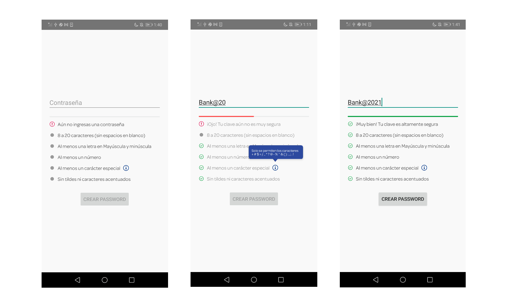

# Password Policy (Test)

... the flexible, easy to use, all in one password enhacer library for your Android project.

-------

<p align="center">
    <a href="#preview">Preview 🚀</a> &bull;
    <a href="#setup">Setup 🛠️</a> &bull;
</p>

-------

# Preview 🚀
## Screenshots 🎉


# Setup
## Latest releases 🛠
- [v1.0.0](https://github.com/AbelTarazona/bank-ui-library-test/tree/v1.0.0)

### 1. Provide the gradle dependency

```gradle
implementation 'com.github.AbelTarazona:bank-ui-library-test:${lastestPasswordPolicyRelease}'
```

### 2. Add the `Password Policy View` into the XML

```kotlin
<LinearLayout xmlns:android="http://schemas.android.com/apk/res/android"
    xmlns:app="http://schemas.android.com/apk/res-auto"
    xmlns:tools="http://schemas.android.com/tools"
    android:layout_width="match_parent"
    android:layout_height="match_parent"
    android:orientation="vertical"
    android:gravity="center"
    tools:context=".TestingLibraryPasswordActivity">

    <EditText
        android:id="@+id/etPassword"
        android:layout_width="match_parent"
        android:layout_height="wrap_content"
        android:hint="Contraseña"
        android:layout_marginHorizontal="20dp"/>

    <com.abeltarazona.passwordpolicylibrary.PasswordPolicy
        android:id="@+id/passwordView"
        android:layout_width="match_parent"
        android:layout_height="wrap_content"/>

    <Button
        android:id="@+id/btnCreate"
        android:layout_marginTop="10dp"
        android:layout_width="wrap_content"
        android:layout_height="wrap_content"
        android:text="Crear password"/>
        
</LinearLayout>
```
For the correct use of the library, you must also add the EditText that will be associated with the password evaluator. Optional is to have a button that will receive events every time the password has met all the criteria.

# Additional Setup
### Add logic to your activity or fragment

```kotlin
binding.passwordView.also {
            it.configure(binding.etPassword)
            it.setCallback { isCompletePasswordPolicy ->
                binding.btnCreate.isEnabled = isCompletePasswordPolicy
            }
        }
```
In the example I'm using ViewBinding but you can initialize your view first.

Great. Your password policy view is now ready to use. 😁

# Developed By

- Abel Tarazona

# License

    Copyright 2021 Abel Tarazona

    Licensed under the Apache License, Version 2.0 (the "License");
    you may not use this file except in compliance with the License.
    You may obtain a copy of the License at

       http://www.apache.org/licenses/LICENSE-2.0

    Unless required by applicable law or agreed to in writing, software
    distributed under the License is distributed on an "AS IS" BASIS,
    WITHOUT WARRANTIES OR CONDITIONS OF ANY KIND, either express or implied.
    See the License for the specific language governing permissions and
    limitations under the License.

